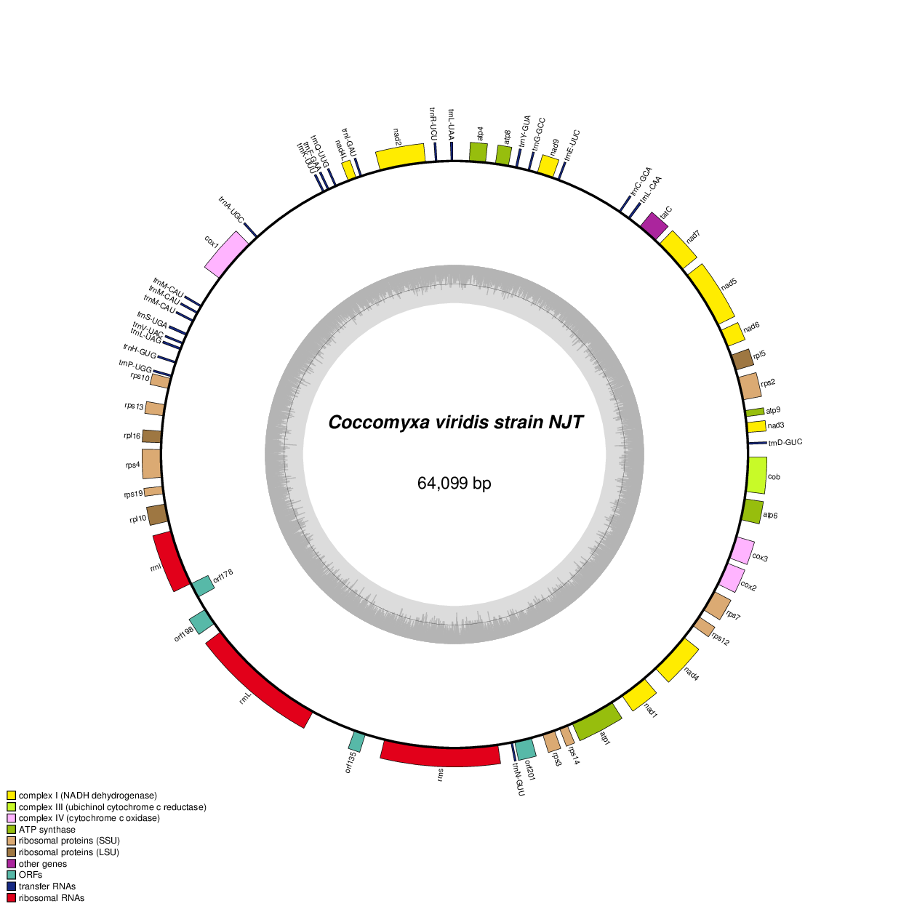

```{r setup, include=FALSE}
knitr::opts_chunk$set(echo = TRUE)
knitr::opts_knit$set(root.dir = "/path/to/repo/notebook")
```

**Rationale:** to publish the genome of the Coccomyxa alga, need to annotate it

## 1. Nuclear genome
### 1.1. Telomeres and GC%
#### Telomere detection
* Used [script from Markus Hiltunen](https://github.com/markhilt/genome_analysis_tools/blob/master/find_telomeres.py)
* As a query used "CCCTAAA", which is a telomeric repeat conserved between green algae and land plants (see [Fulnekova et al. 2012](https://academic.oup.com/gbe/article/4/3/248/563194)). Also searched alternative repeat sequences form the paper, but that didn't yield anything
```{r, eval = FALSE}
python code/detect_telomers.py analysis_and_temp_files/05_annotate_coccomyxa/bin.9_clean_sort_masked.fa -m "CCCTAAA" > analysis_and_temp_files/05_annotate_coccomyxa/telomere_detection.txt
```
* Two contigs, cviridis_6 and cviridis_13, have telomeric repeats on both ends)
* 8 more contigs have telomeric repeats on one end only. Remaining 8 don't have any
* The paper on Coccomyxa subellipsoidea ([Blanc et al. 2012](https://link.springer.com/article/10.1186/gb-2012-13-5-r39)) reported 20 chromosomes, so it's largely consistent

#### Visualizing GC% and telomeres
* Used SEQtk v0.12.0 and got GC% for non-overlapping windows of 1000 bp
```{r, eval = FALSE}
seqkit sliding  analysis_and_temp_files/05_annotate_coccomyxa/bin.9_clean_sort_masked.fa -s 1000 -W 1000  | seqkit fx2tab -n -g > analysis_and_temp_files/05_annotate_coccomyxa/GC_sliding.txt
```
* Visualize
```{r, message = FALSE,warning=FALSE}
library(tidyverse)
library(stringr)
library(viridis)
gc<-read.delim2("../analysis_and_temp_files/05_annotate_coccomyxa/GC_sliding.txt",header=F)[,c(1,4)]
colnames(gc)<-c("window","gc_content")
##get contig name and start of the window
gc$contig<-sub("_sliding.*", "", gc$window)  
gc$window<-sub(".*:", "", gc$window)
gc$window_start<-sub("-.*", "", gc$window) %>% as.numeric()
gc$gc_content<-gc$gc_content %>% as.numeric()

##add data for telomere annotation
tel<-read.delim2("../analysis_and_temp_files/05_annotate_coccomyxa/telomere_detection.txt",header=F)[,c(1,2)]
colnames(tel)<-c("contig","position")
tel_start_contig_list<-tel[tel$position=="forward",1] #list all contigs that have telomer at the contig start (corresponds to 'forward')
tel_end_contig_list<-tel[tel$position=="reverse",1] #list all contigs that have telomer at the contig start (corresponds to 'forward')

## get 
tel_start<-gc %>% select(contig,window_start) %>% mutate(telomere="absent") %>% group_by(contig) %>% arrange(window_start) %>% filter(row_number()<25 & contig %in% tel_start_contig_list) %>% mutate(telomere="present") %>% ungroup()

tel_end<-gc %>% select(contig,window_start) %>% mutate(telomere="absent") %>% group_by(contig) %>% arrange(window_start) %>% 
  slice(tail(row_number(), 25)) %>% filter(contig %in% tel_end_contig_list) %>% mutate(telomere="present") %>% ungroup()

gc<-gc %>% left_join(rbind(tel_start,tel_end))
gc$telomere[is.na(gc$telomere)]<-"absent"

##visualize
ggplot(gc)+
  geom_tile(aes(y=fct_reorder(contig,window_start),x=window_start,color=gc_content))+
  geom_tile(aes(y=fct_reorder(contig,window_start),x=window_start,alpha=telomere),fill="red")+
  xlab("")+ylab("")+
   scale_alpha_discrete(range=c(0,1))+
  scale_color_viridis(begin = 1,end = 0)+
   scale_x_continuous(breaks = c(0,1000000,2000000,3000000,4000000),
                     labels = c("0","1 Mbp","2 Mbp","3 Mbp","4 Mbp"))+
  theme_minimal()
ggsave("../results/contigs_telomers.svg",device="svg",width=4,height=3)
```

### 1.2. Basic assembly stats
* Generated table with lengths of contigs with bioAWK v1.0
```{r, eval = FALSE}
bioawk -c fastx '{ print $name, length($seq) }' < analysis_and_temp_files/05_annotate_coccomyxa/bin.9_clean_sort_masked.fa > analysis_and_temp_files/05_annotate_coccomyxa/nucl_genome_seq_lengths.txt
```
#### Snail plot displaying basic stats of the assembly

```{r, message = FALSE,fig.width=14,fig.height=6}
library(tidyverse)
library(geomtextpath)

lengths<-read.delim("../analysis_and_temp_files/05_annotate_coccomyxa/nucl_genome_seq_lengths.txt",header=F)
colnames(lengths)<-c("contig","length")

#calculate stats
N50 <- lengths$length[cumsum(lengths$length) >= sum(lengths$length)*0.5][1]
N90 <- lengths$length[cumsum(lengths$length) >= sum(lengths$length)*0.9][1]
n50_contig<-lengths$contig[lengths$length==N50]
n90_contig<-lengths$contig[lengths$length==N90]
longest_contig<-lengths$contig[lengths$length==max(lengths$length)]

#prep data for the graph
lengths<-lengths %>% arrange(desc(length))
lengths$cumsum<-cumsum(lengths$length)
lengths$col<-"Assembly: 18 scaffolds, total length: 45.7 Mbp"
lengths$col[lengths$contig==longest_contig]<- "Longest scaffold: 4.3 Mbp"
lengths$col[lengths$contig==n50_contig]<- "N50: 2.5 Mbp, 7 scaffolds"
lengths$col[lengths$contig==n90_contig]<- "N90: 1.7 Mbp, 16 scaffolds"

xlabels<-data.frame(breaks=c(5000000,10000000,15000000,20000000,25000000,30000000,35000000,40000000,max(lengths$cumsum)),
                    labels=c("5 Mbp","10 Mbp", "15 Mbp","20 Mbp","25 Mbp","30 Mbp","35 Mbp","40 Mbp","45.7 Mbp"))

#plot
ggplot(lengths,aes(y=reorder(contig,desc(length)),x=cumsum,fill=col)) +
  geom_bar(stat="identity",color="#d1d1d1")+
  scale_fill_manual(values=c("Assembly: 18 scaffolds, total length: 45.7 Mbp"="#e6e6e6","Longest scaffold: 4.3 Mbp"="#b00202","N50: 2.5 Mbp, 7 scaffolds"="#e36402","N90: 1.7 Mbp, 16 scaffolds"="#f0a700"))+
  scale_x_continuous(breaks=xlabels$breaks,labels=xlabels$labels)+
  geom_vline(xintercept = max(lengths$length),color="red") + 
  geom_vline(xintercept = max(lengths$cumsum)*0.5,color="orange")  +
  geom_vline(xintercept = max(lengths$cumsum)*0.9,color="#ffc642")  +
  theme_minimal()+ylab("")+xlab("")+theme(axis.title.y = element_blank(),axis.text.y = element_blank(),
                                          panel.grid.major = element_blank(), panel.grid.minor = element_blank(),
                                         axis.text.x = element_text(size=9,vjust=0),
                                         legend.title = element_blank(),
                                         legend.text = element_text(size=9))+
  coord_curvedpolar()


ggsave("../results/snailplot.svg",device="svg",width=6,height=3)
```

#### Genome completeness: BUSCO stats
```{r, message = FALSE,fig.width=14,fig.height=3}
library(tidyverse)
library(geomtextpath)

busco<-read.delim("../analysis_and_temp_files/02_binning/short_summary.specific.chlorophyta_odb10.GTX0488_bin9.txt",header=F,skip = 9)
busco$type<-c("Complete (96.7%)","Duplicated (0.2%)","Fragmented (0.6%)","Missing (2.5%)","Total")
busco<-busco[1:4,]
hsize <- 1.5
busco$x<-hsize

ggplot(busco,aes(y=V2,fill=type,x=hsize))+geom_col()+
  coord_curvedpolar(theta = "y")+  xlim(c(0.2, hsize + 0.5))+
  scale_fill_manual(values=c("Complete (96.7%)"="#60ba30","Duplicated (0.2%)"="#1f5900","Fragmented (0.6%)"="#ccf2b8","Missing (2.5%)"="white"))+
  theme_void()+theme(legend.title = element_blank(),legend.text = element_text(size=9),
                     legend.key=element_rect(colour="#969696"))
ggsave("../results/busco.svg",device="svg",width=4,height=2)
```


## 2. Nuclear genome: functional annotation

### 2.1. Install funannotate
* Tried the funannotate docker image via singularity (funanotate v1.8.15).This version, couldn't access from a regular node 
```{r, eval = FALSE}
ssh software
cd /tsl/scratch/gol22pin/singularity
singularity pull funannotate.sif docker://nextgenusfs/funannotate
```

### 2.2 Prepare the assembly for annotation
* Ran it inside the funannotate image, by copying files in it, and then copying them back to the work folder
```{r, eval = FALSE}
cp analysis_and_temp_files/02_binning/bin.9.fa /tsl/scratch/gol22pin/singularity/funannotate 
cd /tsl/scratch/gol22pin/singularity
```
* Cleaned, sorted, and masked the assembly
```{r, eval = FALSE}
singularity shell -w funannotate/
funannotate clean -i bin.9.fa -o bin.9_clean.fa
funannotate sort -i bin.9_clean.fa -o bin.9_clean_sort.fa -b cviridis
funannotate mask -i bin.9_clean_sort.fa -o bin.9_clean_sort_masked.fa --cpus 10
```
* Results:  18 scaffolds; 45,727,155 bp; 2.45% repeats masked

### 2.3. Aligned RNA-seq data from the pure culture of Coccomyxa
* This analysis informed me in which libraries have good mapping rates and can be used for the annotation

#### Preparation
* Copied the prepared assembly into the work folder
```{r, eval = FALSE}
cp ../singularity/funannotate/bin.9_clean_sort_masked.fa analysis_and_temp_files/05_annotate_coccomyxa/
```
#### Alignment
* Used STAR
* Implemented as a part of Snakemake pipeline `analysis_and_temp_files/05_annotate_coccomyxa/Snakemake_annotate`

#### Results
* Most mapped very well, but several didn't map at all
* None of the 9 dpi set align. 2 dpi aligned poorly (~60%). Older time points (21 and 42 dpi) aligned best. Preliminary taxonomic profiles of these libraries show 9 dpi libraries to have more bacterial hits. Perhaps they have a higher rate of contamination?

### 2.4 Train
* Train the funannotate models
* Figured out how to run funannotagte outside of the contained
* Picked the libraries with >80% alignment rate
```{r, eval = FALSE}
singularity run ../singularity/funannotate.sif funannotate train -i analysis_and_temp_files/05_annotate_coccomyxa/bin.9_clean_sort_masked.fa -o analysis_and_temp_files/05_annotate_coccomyxa/cviridis_preds  \
    --left /path/to/KS21TB1_1.fq.gz  /path/to/KS21TB2_1.fq.gz /path/to/S_21TB3_1.fq.gz /path/to/S_42TB1_1.fq.gz /path/to/S_42TB2_1.fq.gz /path/to/S_42TB3_1.fq.gz \
    --right /path/to/KS21TB1_2.fq.gz  /path/to/KS21TB2_2.fq.gz /path/to/S_21TB3_2.fq.gz /path/to/S_42TB1_2.fq.gz /path/to/S_42TB2_2.fq.gz /path/to/S_42TB3_2.fq.gz \
    --species "Coccomyxa viridis" \
    --cpus 20 --memory 80G
```

### 2.5. Predict genes
```{r, eval = FALSE}
singularity run ../singularity/funannotate.sif funannotate predict -i analysis_and_temp_files/05_annotate_coccomyxa/bin.9_clean_sort_masked.fa \
            -o analysis_and_temp_files/05_annotate_coccomyxa/cviridis_preds -s "Coccomyxa viridis" --cpus 20  --optimize_augustus
```
### 2.6. Functional annotations
#### InterProScan
* Runing interproscan via `funannotate iprscan` failed, despite many attempts
* In the end, I run interposcan as stand alone 
```{r, eval = FALSE}
/path/to/interproscan/5.42/interproscan.sh   -i analysis_and_temp_files/05_annotate_coccomyxa/cviridis_preds/predict_results/Coccomyxa_viridis.proteins.fa  -d  analysis_and_temp_files/05_annotate_coccomyxa/cviridis_preds/annotate_misc/ -dp -f XML -goterms -dra -cpu 20
```

#### Funannotate annotate
```{r, eval = FALSE}
singularity run ../singularity/funannotate.sif funannotate annotate -i  analysis_and_temp_files/05_annotate_coccomyxa/cviridis_preds/  --cpus 20 --iprscan analysis_and_temp_files/05_annotate_coccomyxa/cviridis_preds/annotate_misc/Coccomyxa_viridis.proteins.fa.xml --busco_db /tsl/data/busco_lineages/chlorophyta_odb10  --sbt analysis_and_temp_files/05_annotate_coccomyxa/template.sbt
```

### 2.7. Results
```
[May 31 05:22 PM]: Annotation consists of: 11,248 gene models
[May 31 05:22 PM]: 11,202 protein records loaded
[May 31 05:22 PM]: Running HMMer search of PFAM version 35.0
[May 31 05:27 PM]: 12,142 annotations added
[May 31 05:27 PM]: Running Diamond blastp search of UniProt DB version 2023_01
[May 31 05:28 PM]: 460 valid gene/product annotations from 770 total
[May 31 05:28 PM]: Combining UniProt/EggNog gene and product names using Gene2Product version 1.88
[May 31 05:28 PM]: 460 gene name and product description annotations added
[May 31 05:28 PM]: Running Diamond blastp search of MEROPS version 12.0
[May 31 05:28 PM]: 358 annotations added
[May 31 05:28 PM]: Annotating CAZYmes using HMMer search of dbCAN version 11.0
[May 31 05:29 PM]: 316 annotations added
[May 31 05:29 PM]: Annotating proteins with BUSCO /tsl/data/busco_lineages/chlorophyta_odb10 models
[May 31 05:31 PM]: 1,470 annotations added
[May 31 05:31 PM]: Parsing InterProScan5 XML file
[May 31 05:31 PM]: Found 0 duplicated annotations, adding 54,302 valid annotations
```

* Got a table with all InterProScan annotations
```{r,eval=FALSE}
cut -f1,14 < analysis_and_temp_files/05_annotate_coccomyxa/cviridis_preds/annotate_results/Coccomyxa_viridis.annotations.txt > analysis_and_temp_files/05_annotate_coccomyxa/cviridis_ipr_annotations.txt
```

### 2.8. Comparing to related algae
* Compared our genome to the genome analyzed in [Puginier et al. 2022](https://www.biorxiv.org/content/10.1101/2022.01.06.475074v2)
  * Only included genomes, all transcriptomes were removed
  * Only included Trebouxiophyceae
* Our genome is slightly smaller compared to other Coccomyxa species, but had more genes
```{r, message = FALSE,warning=FALSE,fig.width=10}
library(tidyverse)
library(patchwork)

#basic genome stats
stats<-read.delim2("../analysis_and_temp_files/05_annotate_coccomyxa/puginier_genome_stats.txt")
stats$genome_size<-as.numeric(stats$Genome.size..Mb.)

##filter and add row for our alga
stats<- stats %>% filter(Resource.type=="G",Class=="Trebouxiophyceae") %>%
  select(Species,ecology,clade,Abbreviation,genome_size,Number.of.CDS.proteins) 
cviridis<-data.frame("Species"="Coccomyxa viridis NJT strain","ecology"="lichen epiphyte","clade"="Elliptochloris-clade","Abbreviation"="cviridis","genome_size"=45.7,"Number.of.CDS.proteins"=11202)
stats<-rbind(stats,cviridis)

stats$clade<-factor(stats$clade,levels=c("Chlorellales","Elliptochloris-clade","Apatococcus-clade","Trebouxiales"))
stats<-stats %>% mutate(color=ifelse(Abbreviation=="cviridis","red","grey"))

genome_size<-ggplot(stats,aes(y=genome_size,x=Species,fill=color))+
  geom_bar(stat="identity",show.legend = FALSE)+
  xlab("")+ylab("Genome Size, Mbp")+
  coord_flip()+theme_light()+
  facet_grid(clade~.,scales="free", space='free')+
scale_fill_manual(values = c("grey","#ab1207"))+
  scale_y_continuous(expand=expansion(mult=0,add=0),position = "right", sec.axis = dup_axis())+
   theme(text=element_text(size=11),
         axis.text.y = element_blank(),
        strip.background = element_blank(),
  strip.text.y = element_blank(),
         legend.position = "none",
        axis.text.x.top = element_blank(), # remove ticks/text on labels
        axis.ticks.x.top = element_blank(),
        axis.text.y.right = element_blank(),
        axis.ticks.y.right = element_blank(),
        axis.title.x.bottom = element_blank(), # remove titles
        axis.title.y.left = element_blank())

proteome<-ggplot(stats,aes(y=Number.of.CDS.proteins,x=Species,fill=color))+
  geom_bar(stat="identity",show.legend = FALSE)+
  xlab("")+ylab("Number of predicted proteins")+
  coord_flip()+
  facet_grid(clade~.,scales="free", space='free')+theme_light()+
  scale_fill_manual(values = c("grey","#ab1207"))+
  scale_y_continuous(expand=expansion(mult=0,add=0),position = "right", sec.axis = dup_axis())+
   theme(text=element_text(size=11),
         axis.text.y = element_blank(),
        strip.text.y = element_text(angle=0,colour = "black",hjust = 0),
         legend.position = "none",
        strip.background = element_rect(fill="white"),
        axis.text.x.top = element_blank(), # remove ticks/text on labels
        axis.ticks.x.top = element_blank(),
        axis.text.y.right = element_blank(),
        axis.ticks.y.right = element_blank(),
        axis.title.x.bottom = element_blank(), # remove titles
        axis.title.y.left = element_blank())


ecology<-ggplot(stats,aes(color=ecology,x=Species))+geom_point(y=0,size=4)+
  xlab("")+ylab("")+ylim(-0.1,0.1)+
  coord_flip()+
  facet_grid(clade~.,scales="free", space='free')+
  theme( text=element_text(size=11),
         axis.text.x = element_blank(),
         axis.line.x = element_blank(),
         axis.ticks.x = element_blank(),
    strip.background = element_blank(),
  strip.text.y = element_blank(),
  panel.grid = element_blank(),
  panel.background = element_blank(), panel.border = element_blank(),
  legend.position="bottom",
  legend.key = element_rect(fill = "white"))+
  scale_color_manual(values=c(palette.colors(palette="Pastel 2")[4],
                              palette.colors(palette="Pastel 2")[3],
                              "#ab1207",
                              palette.colors(palette="Pastel 2")[5],
                              palette.colors(palette="Pastel 2")[1],
                              palette.colors(palette="Pastel 2")[2]))

plot<-ecology+genome_size+proteome & theme(legend.position = "bottom")
plot+plot_layout(widths = c(1, 10, 10),guides = "collect")
ggsave("../results/comp_genomes.svg",device="svg",width=7,height=5)
```

* Checked the InterProScan protein families that Puginier et al. identified as connected with lichenization
* Our genome, unlike other Coccomyxa species, has no GH8 genes (according to InterProScan, but this observation is confirmed by CAZy annotations). GH8 is a family containing licheninases,  chitosanase, beta-glucanases and such. Our genome contains one gene assigned to GH16, which is another family containing licheninases
* unlike other Coccomyxa species, our genome has Nitrile Hydratases

```{r, message = FALSE,warning=FALSE,fig.width=10}
#iprscan
ipr<-read.delim2("../analysis_and_temp_files/05_annotate_coccomyxa/puginier_species_IPR_count.txt") %>%
  pivot_longer(-IPR,names_to="Abbreviation",values_to = "count")

##filter to include only trebouxiphyceae and only IPR ids of interest
ipr_list<-read.delim2("../analysis_and_temp_files/05_annotate_coccomyxa/puginier_IPR_selected.txt")
colnames(ipr_list)<-c("IPR","IPR_function")
ipr<- ipr %>% filter(Abbreviation %in% stats$Abbreviation, IPR %in% ipr_list$IPR) 

##add our alga
cviridis_ipr<-read.delim2("../analysis_and_temp_files/05_annotate_coccomyxa/cviridis_ipr_annotations.txt") %>% filter(InterPro!="") 

### split multiple ipr annotations
max_ipr_ann<-max(str_count(cviridis_ipr$InterPro,";"))+1
column_names<-paste0("IPR_annotation",0:max_ipr_ann)
cviridis_ipr<-cviridis_ipr %>% separate(InterPro,sep=";",into=column_names) %>%
  pivot_longer(-GeneID,names_to = "tmp",values_to = "IPR") %>%
  filter(!is.na(IPR)) %>% select(-tmp)
cviridis_ipr$IPR<- sub(" .*", "", cviridis_ipr$IPR)

### summarize the number of IPR of interest
cviridis_ipr <- cviridis_ipr %>% filter(IPR %in% ipr_list$IPR) %>%
  group_by(IPR) %>% summarize(count=n()) %>% mutate(Abbreviation="cviridis")

###combined the two tables and added zeros
ipr<-rbind(ipr,cviridis_ipr)
ipr<-ipr %>% pivot_wider(names_from = IPR,values_from = count,values_fill = 0) %>%
  pivot_longer(-Abbreviation,names_to = "IPR",values_to = "count")

## visualize
data<-left_join(ipr,stats) %>% left_join(ipr_list)

ipr_plot<-ggplot(data,aes(x=IPR,y=Species,size=ifelse(count==0, NA, count),color=color))+geom_point(alpha=0.7)+
  scale_size(range = c(1, 6),name = "Number of Genes")+
  facet_grid(clade~IPR_function,scales="free", space='free')+theme_light()+
  scale_color_manual(values = c("grey","#ab1207"))+
  xlab("")+ylab("")+
   theme(text=element_text(size=11),
         axis.text.x = element_text(angle = 90),
         strip.text.y = element_text(angle=0,colour = "black",hjust = 0),
         strip.text.x = element_text(colour = "black"),
         legend.position = "none",
         axis.text.y = element_blank(),
        axis.ticks.y = element_blank(),
        strip.background = element_rect(fill="white"))+
  guides(color = FALSE)    
 
plot2<-ecology+ipr_plot & theme(legend.position = "bottom")
plot2+plot_layout(widths = c(1, 20),guides = "collect")
ggsave("../results/comp_ann.svg",device="svg",width=7.5,height=5.5)
```

### 2.9. Secondary metabolism
* Annotated the nuclear genome with fungiSMASH. I picked the fungal version and not the plant one following [O'Neill 2020](https://www.mdpi.com/1660-3397/18/2/90)
* Got many more clusters than O'Neill 2020 reported for Chlorophyta (17 clusters vs 7 clusters they reported for C. subellipsoidea)
* Re-annotated C. subellipsoidea and got comparable number of clusters:
```{r}
read.delim2("../results/antismash_results.txt")
```


### 2.10. KEGG anotations
* Used KAAS webserver
* Saved the output as `../analysis_and_temp_files/05_annotate_coccomyxa/kaas_results.txt`
* Visualized with KEGG Reconstruct Pathway
* Nothing conclusive

### 2.11. Look into signaling components
* Took the list of signaling elements expanded in Asterochloris compared to Chlorella and C. subellipsoidea
* The list is from [Armaleo et al. 2019](https://bmcgenomics.biomedcentral.com/articles/10.1186/s12864-019-5629-x#MOESM8), saved as `../analysis_and_temp_files/05_annotate_coccomyxa/armaleo_signal.txt`
* In the paper (Additional file 8), they give PFAM families. Here, I manually translated them into IPR domains using the IPR website. Removed the lines where they counted the number of proteins with a certain combination of PFAM domains, since I don't have these data for the reference genomes
* Profile mostly similar to C. subellipsoidea. Hovewer, two families appear expanded in C.viridis: 	
  * IPR000719 = protein kinase (PF00069). The highest number of all, higher than Asterochloris
  * IPR000595 = Cyclic nucleotide-binding domain (PF00027). Less than Asterochloris but higher than the others
* Saved the tables as 
```{r}
signal<-read.delim2("../analysis_and_temp_files/05_annotate_coccomyxa/armaleo_signal.txt")

##add our alga
cviridis_ipr<-read.delim2("../analysis_and_temp_files/05_annotate_coccomyxa/cviridis_ipr_annotations.txt") %>% filter(InterPro!="") 

### split multiple ipr annotations
max_ipr_ann<-max(str_count(cviridis_ipr$InterPro,";"))+1
column_names<-paste0("IPR_annotation",0:max_ipr_ann)
cviridis_ipr<-cviridis_ipr %>% separate(InterPro,sep=";",into=column_names) %>%
  pivot_longer(-GeneID,names_to = "tmp",values_to = "IPR") %>%
  filter(!is.na(IPR)) %>% select(-tmp)
cviridis_ipr$IPR<- sub(" .*", "", cviridis_ipr$IPR)

### summarize the number of IPR of interest
cviridis_ipr <- cviridis_ipr %>% filter(IPR %in% signal$IPR) %>%
  group_by(IPR) %>% summarize(count=n()) %>% mutate(Abbreviation="cviridis")

###combined the two tables and added zeros
signal2<- signal %>% select(-PFAM) %>% pivot_longer(-IPR, names_to = "Abbreviation",values_to = "count")
signal3<-rbind(signal2,cviridis_ipr)
signal4<-signal3 %>% pivot_wider(names_from = Abbreviation,values_from = count,values_fill = 0) %>%
 left_join(signal)

###saved the result
write.table(signal4,"../results/signaling.txt",sep="\t",quote = F, row.names = F, col.names=T)

###visualized
signal5<-signal3 %>% pivot_wider(names_from = Abbreviation,values_from = count,values_fill = 0) %>%
  pivot_longer(-IPR,names_to = "Abbreviation",values_to = "count")  %>% 
  mutate(Species=ifelse(Abbreviation=="cviridis","Coccomyxa viridis",
                        ifelse(Abbreviation=="Coccomyxa_C169","Coccomyxa subellipsoidea",
                               ifelse(Abbreviation=="Asterochloris","Asterochloris","Chlorella NC64A"))))

ggplot(signal5,aes(x=IPR,y=Species,size=ifelse(count==0, NA, count)))+geom_point(alpha=0.7)+
  scale_size(range = c(1, 6),name = "Number of Genes")+
  xlab("")+ylab("")+
   theme(text=element_text(size=11),
         axis.text.x = element_text(angle = 90),
         legend.position = "none",
        axis.ticks.y = element_blank(),
        strip.background = element_rect(fill="white"))
  

```
* Sanity check: is the pfam-based annotation of C. subellipsoidea from Armaleo et al. comparable with the IPR-based annotations from Puginier? Mostly yes
```{r}
ipr<-read.delim2("../analysis_and_temp_files/05_annotate_coccomyxa/puginier_species_IPR_count.txt") %>%
  pivot_longer(-IPR,names_to="Abbreviation",values_to = "count")
compare_cosub1<- ipr %>% filter(Abbreviation == "CocsubC169", IPR %in% signal$IPR) %>% mutate(Puginier=count) %>%
  select(IPR, Puginier)

signal4 %>% mutate(Armaleo=Coccomyxa_C169) %>%
  select(IPR, Armaleo,cviridis) %>% left_join(compare_cosub1)
```
* The two potentially expanded families, how do they look in the Puginier dataset?
  * IPR000595 is only sligthly bigger than in other Coccomyxas (18 vs 16)
  * IPR000719 is bigger than in other Coccomyxas (238 vs 222). According to Puginier, Asterochloris and other Trebouxia are even higher
```{r}
ipr<-read.delim2("../analysis_and_temp_files/05_annotate_coccomyxa/puginier_species_IPR_count.txt") %>%
  pivot_longer(-IPR,names_to="Abbreviation",values_to = "count")
compare_expanded<- ipr %>% filter(IPR %in% c("IPR000719","IPR000595"),
                                 Abbreviation %in% stats$Abbreviation ) 

signal4 %>% mutate(Armaleo=Coccomyxa_C169) %>%
  select(IPR, Armaleo,cviridis) %>% left_join(compare_cosub1)
```


## 3. Mitochondrial genome

#### Extracted the contig
* Used SAMtools v1.12
```{r, eval = FALSE}
samtools faidx data/FG23004_01_flye-medaka_2xpilon.fasta contig_67_pilon_pilon > analysis_and_temp_files/05_annotate_coccomyxa/GTX0488_mitochondrion.fa
```

#### Aligned RNA-seq data
* For simplicity, only aligned one. Picked library S_42TB3, because it had the highest number of reads aligned to the Coccomyxa genome
* Aligned using STAR v2.5.4b
```{r, eval = FALSE}
mkdir analysis_and_temp_files/05_annotate_coccomyxa/GTX0488_mitochondrion_STAR_index -p
STAR --runThreadN 20  --genomeSAindexNbases 6 \
--runMode genomeGenerate \
--genomeDir analysis_and_temp_files/05_annotate_coccomyxa/GTX0488_mitochondrion_STAR_index \
--genomeFastaFiles analysis_and_temp_files/05_annotate_coccomyxa/GTX0488_mitochondrion.fa

code/star_align.sh /tsl/data/reads/ntalbot/lichen_coculture_i_42_days/42t_bmm3_ks/s_42tb3/raw/S_42TB3_1.fq.gz /tsl/data/reads/ntalbot/lichen_coculture_i_42_days/42t_bmm3_ks/s_42tb3/raw/S_42TB3_2.fq.gz analysis_and_temp_files/05_annotate_coccomyxa/GTX0488_mitochondrion_STAR_index/touch 10 analysis_and_temp_files/05_annotate_coccomyxa/rna_align/GTX0488_mitochondrion_S_42TB3.Aligned.sortedByCoord.out.bam

samtools index analysis_and_temp_files/05_annotate_coccomyxa/rna_align/GTX0488_mitochondrion_S_42TB3.Aligned.sortedByCoord.outAligned.sortedByCoord.out.bam
```

#### Initial annotation

* Used MFannot v1.35 for annotation; used a script within AGAT v0.9.2 to tranform the sqn output file into gff
```{r, eval = FALSE}

mfannot analysis_and_temp_files/05_annotate_coccomyxa/GTX0488_mitochondrion.fa 
mv GTX0488_mitochondrion.fa* analysis_and_temp_files/05_annotate_coccomyxa/GTX0488_mito_tmp

agat_convert_mfannot2gff.pl -i analysis_and_temp_files/05_annotate_coccomyxa/GTX0488_mito_tmp/GTX0488_mitochondrion.fa.new -o analysis_and_temp_files/05_annotate_coccomyxa/GTX0488_mito_tmp/GTX0488_mitochondrion_mfannot.gff
```
* Used the AGORA webserver with default settings; used the bp_genbank2gff3.pl from prokka v1.13.3 to convert the gbk output to gff
```{r, eval = FALSE}
bp_genbank2gff3.pl analysis_and_temp_files/05_annotate_coccomyxa/GTX0488_mito_tmp/GTX0488_mito_agora/out.pos --outdir analysis_and_temp_files/05_annotate_coccomyxa/GTX0488_mito_tmp/GTX0488_mito_agora/
```
* Used GeSeq webserver
  * Default settings; included ARAGORN v1.2.38 and tRNAscan-SE v2.0.7 annotations
  * Botryococcus braunii and Coccomyxa  C-169 as references
  * Saved the file as `analysis_and_temp_files/05_annotate_coccomyxa/GTX0488_mito_tmp/GTX0488_mito_geseq.*`
  
#### Finalized the annotation
* This part was done in Geneious
* Compared all three annotations to each other
  * AGORA was not consistent with the other two
  * MFannot and GeSeq were very consistent in protein-coding genes, but completely inconsistent with rRNA
* Cross-validated the annotations with the RNA-seq BAM, and it appears that best way forward is to create a hybrid annotation based on both MFannot and GeSeq 
* Used Geneious to combine MFannot and GeSeq gffs and saved it as `analysis_and_temp_files/05_annotate_coccomyxa/GTX0488_mito_tmp/GTX0488_mito_geseq_mfannot.gff`
* Loaded the combined gff back into Geneious and manually corrected annotations using RNA data
* Exported it as `analysis_and_temp_files/05_annotate_coccomyxa/GTX0488_mito_tmp/GTX0488_mitochondrion_manual.gff`. This file, however, wasn't parsable, because of the inconsistent labeling. Fixed it in R

```{r, message = FALSE}
library(tidyverse)
gff_full<-read.delim("../analysis_and_temp_files/05_annotate_coccomyxa/GTX0488_mito_tmp/GTX0488_mitochondrion_manual.gff", header=F, comment.char="#")

gff<-gff_full[3:nrow(gff_full),] #removed first two rows, which correspond to the entire mitogenome
gff<-gff %>%  filter(V3!="Junction")  
gff$gene<-str_match(gff$V9, "Name=(.*?)(?:\\;|$)")[, 2] # added column with gene name extracted from the name tag

#make new IDs and assign parents for genes
gff_gene<-gff %>% filter(V3=="gene") #make a table with 'gene' features
gff_gene$id<-paste0("mito",1:nrow(gff_gene))

#easy case: tRNA and protein-coding genes. for them, only kept tRNA and CDS features (since exon is redundant and mRNA optional). ids are based on the gene ids (i.e. gene id is 'mito1', and exon id is 'exon-mito1')
gff_cds<-gff %>% filter(V3 %in% c("tRNA","CDS") & !(gene %in% c("orf256","orf208"))) %>% left_join(gff_gene %>% select(id,gene)) %>% 
  mutate(parent=id) %>%  mutate(id=ifelse(V3=="CDS",paste0("cds-",id),paste0("trna-",id))) 

#rRNA genes set manually
gff_rrna<-gff %>% filter(gene %in% c("rrnl","rrnL","rrns","orf256","orf208"),!(V3 %in% c("intron","gene"))) %>% left_join(gff_gene %>% select(id,gene)) %>% mutate(gene_id=id)
gff_rrna[gff_rrna$gene=="orf256",]$id<-gff_gene[gff_gene$gene=="rrnL",]$id #for the two orfs found in the intron of rnL, I used ids based of the rnL, and will use rnL as the parent
gff_rrna[gff_rrna$gene=="orf208",]$id<-gff_gene[gff_gene$gene=="rrnL",]$id
gff_rrna<-gff_rrna%>% mutate(gene_id=id)#added gene ids

#first, got ids. to make them unique, attached to duplicated numbers ()
gff_rrna$id<-paste0(gff_rrna$V3,"-",gff_rrna$gene_id)
gff_rrna<-gff_rrna %>% group_by(id) %>% mutate(n=row_number()) %>% 
  mutate(id=ifelse(n>1,paste(id,n,sep="-"),id))

#second, fix parents
#for rnas, parent is the gene
gff_rrna<-gff_rrna %>% mutate(parent=ifelse(V3 %in%c("rRNA","mRNA"),gene_id,NA))
#for exons, parent is rna that covers it
gff_rrna[gff_rrna$id=="exon-mito43",]$parent<-"rRNA-mito43"
gff_rrna[gff_rrna$id=="exon-mito48",]$parent<-"rRNA-mito48"
gff_rrna[gff_rrna$id=="exon-mito48-2",]$parent<-"rRNA-mito48"
gff_rrna[gff_rrna$id=="exon-mito46",]$parent<-"rRNA-mito46"
gff_rrna[gff_rrna$id=="exon-mito46-3",]$parent<-"rRNA-mito46"
gff_rrna[gff_rrna$id=="exon-mito46-5",]$parent<-"rRNA-mito46"
gff_rrna[gff_rrna$id=="exon-mito46-4",]$parent<-"mRNA-mito46-2"
gff_rrna[gff_rrna$id=="exon-mito46-2",]$parent<-"mRNA-mito46"
gff_rrna[gff_rrna$id=="CDS-mito46-2",]$parent<-"mRNA-mito46-2"
gff_rrna[gff_rrna$id=="CDS-mito46",]$parent<-"mRNA-mito46"
  
#combine all tables
gff_all<-gff_rrna %>% select(-gene_id,-n) %>% rbind(gff_cds,gff_gene) 

#make V9 labels
gff_all<-gff_all %>% 
  mutate(label=ifelse(V3=="gene",paste0("ID=",id,";Name=",gene,";locus_tag=",id,";gene=",gene,";gbkey=",V3),
    ifelse(V3=="exon" | gene == "orf256" | gene == "orf208",
           paste0("ID=",id,";Name=",gene,";locus_tag=",id,";gene=",gene,";gbkey=",V3,";Parent=",parent),
           paste0("ID=",id,";Name=",gene,";locus_tag=",id,";gene=",gene,";gbkey=",V3,";Parent=",parent,";product=",gene)))) %>% ungroup()

gff_all<-gff_all %>% select(V1,V2,V3,V4,V5,V6,V7,V8,label)

#write the amended file
cat("##gff-version 3\n",file="../analysis_and_temp_files/05_annotate_coccomyxa/GTX0488_mitochondrion_mfannot_fixed.gff")
write.table(gff_all,"../analysis_and_temp_files/05_annotate_coccomyxa/GTX0488_mitochondrion_mfannot_fixed.gff",append=TRUE,sep="\t",quote = F, row.names = F, col.names=F)

```
* Opened the amended gff in Geneious and saved it as `analysis_and_temp_files/05_annotate_coccomyxa/GTX0488_mitochondrion_mfannot_fixed.gb`, using "Coccomyxa viridis starin NJT" as the organism name
* Visualized the annotation used the [OGDraw webserver](https://chlorobox.mpimp-golm.mpg.de/OGDraw.html). Saved the graphis as `results/GTX0488_mitochondrion_mfannot_fixed.pdf`



## 4. Plastid genome
#### Extract the contig
```{r, eval = FALSE}
samtools faidx data/FG23004_01_flye-medaka_2xpilon.fasta contig_59_pilon_pilon > analysis_and_temp_files/05_annotate_coccomyxa/GTX0488_plastid.fa
```

#### Aligning RNA data
* Followed the same steps as for the mitochondrion
```{r, eval = FALSE}
mkdir analysis_and_temp_files/05_annotate_coccomyxa/GTX0488_plastid_STAR_index -p
STAR --runThreadN 20  --genomeSAindexNbases 6 \
--runMode genomeGenerate \
--genomeDir analysis_and_temp_files/05_annotate_coccomyxa/GTX0488_plastid_STAR_index \
--genomeFastaFiles analysis_and_temp_files/05_annotate_coccomyxa/GTX0488_plastid.fa
code/star_align.sh /tsl/data/reads/ntalbot/lichen_coculture_i_42_days/42t_bmm3_ks/s_42tb3/raw/S_42TB3_1.fq.gz /tsl/data/reads/ntalbot/lichen_coculture_i_42_days/42t_bmm3_ks/s_42tb3/raw/S_42TB3_2.fq.gz analysis_and_temp_files/05_annotate_coccomyxa/GTX0488_plastid_STAR_index/touch 10 analysis_and_temp_files/05_annotate_coccomyxa/rna_align/GTX0488_plastid_S_42TB3.bam
samtools index analysis_and_temp_files/05_annotate_coccomyxa/rna_align/GTX0488_plastid_S_42TB3Aligned.sortedByCoord.out.bam
```

#### Initial annotation

* Used MFannot for annotation; used a script within AGAT to tranform the sqn output file into gff
```{r, eval = FALSE}
mfannot analysis_and_temp_files/05_annotate_coccomyxa/GTX0488_plastid.fa 
mv GTX0488_plastid.fa* analysis_and_temp_files/05_annotate_coccomyxa/

agat_convert_mfannot2gff.pl -i analysis_and_temp_files/05_annotate_coccomyxa/GTX0488_plastid.fa.new -o analysis_and_temp_files/05_annotate_coccomyxa/GTX0488_plastid_tmp/GTX0488_plastid_mfannot.gff
```
* GeSeq 
  * Default settings; included ARAGORN v1.2.38 and tRNAscan-SE v2.0.7 annotations
  * Paradoxia multiseta and Coccomyxa  C-169 as references
  * Saved the file as `analysis_and_temp_files/05_annotate_coccomyxa/GTX0488_plastid_tmp/TX0488_plastid_geseq.*`
  
#### Finalized annotation
* This part was done in Geneious
* Cross-validated the two annotations with the RNA-seq BAM, and it appears that best way forward is to create a hybrid annotation based on both MFannot and GeSeq 
* Created combined files `analysis_and_temp_files/05_annotate_coccomyxa/GTX0488_plastid_tmp/GTX0488_plastid_manual.gff` and `.gb`
  * Used Geneious
  * As a base, used GeSeq annotation. Changed some CDS and gene boundaries to match RNA data and ORF boundaries. Added several genes from the MFannot annotations that were missing in MFannot (the ones supported by the RNA data) 
* To create a final gff, modified it in R (to remove Junction annotations)  
  * Since this time I filled features of annotation in Geneious, I didn't need to do it via R
  * **NB:** however, I didn't fix product and parent tag. Will see during the submission, how this is done best. In the future, can use AGORA output to match gene names with products
```{r, message = FALSE}
library(tidyverse)
gff_full<-read.delim("../analysis_and_temp_files/05_annotate_coccomyxa/GTX0488_plastid_tmp/GTX0488_plastid_manual.gff", header=F, comment.char="#")
gff<-gff_full %>%  filter(V3!="Junction")  
#write the amended file
cat("##gff-version 3\n",file="../analysis_and_temp_files/05_annotate_coccomyxa/GTX0488_plastid_fixed.gff")
write.table(gff,"../analysis_and_temp_files/05_annotate_coccomyxa/GTX0488_plastid_fixed.gff",append=TRUE,sep="\t",quote = F, row.names = F, col.names=F)
``` 
* Used the `analysis_and_temp_files/05_annotate_coccomyxa/GTX0488_plastid_tmp/GTX0488_plastid_manual.gb` file to draw a map
* Visualized the annotation used the [OGDraw webserver](https://chlorobox.mpimp-golm.mpg.de/OGDraw.html). Saved the graphis as `results/GTX0488_mitochondrion_mfannot_fixed.pdf`


